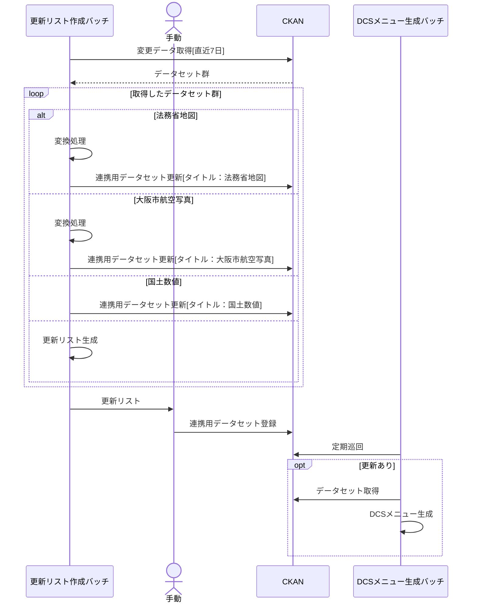
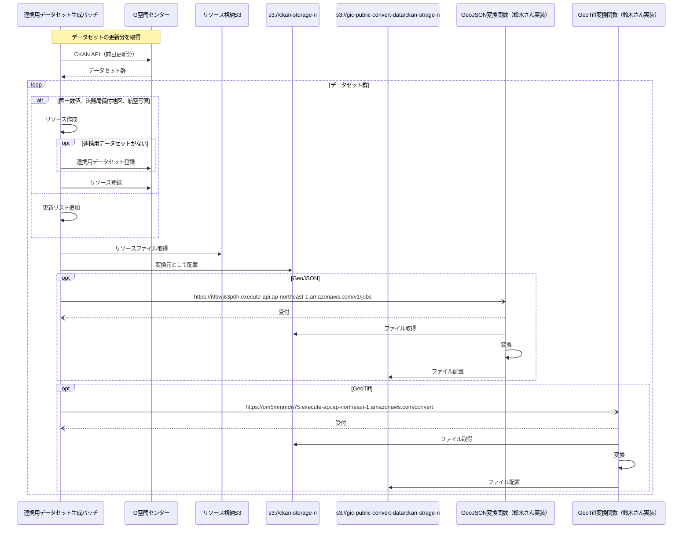
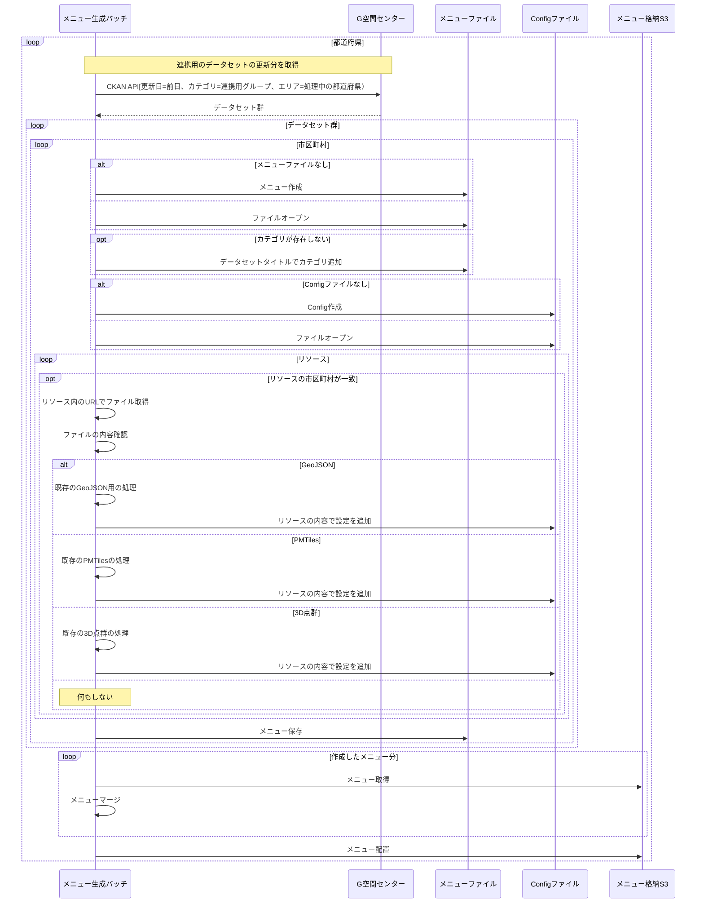

# G空間・DCS自動連携

## 処理フローの詳細

### データフロー概要

1. DCSメニュー生成バッチが、G空間センターからCKAN APIを使って直近7日間の更新データを取得
    - 対象：「登記所備付地図」または「大阪市航空写真」の文字列をタイトルに含むデータセット
2. 取得したデータセットごとに以下の処理を実行:
    - リソース格納S3からリソースファイルを取得
    - GeoJSONまたはGeoTiffファイルの場合のみ、以下の変換処理を実行:
        - 変換先S3に変換元ファイルを配置
        - 変換関数（鈴木さん実装）を呼び出し
        - 変換関数が変換済みファイルを変換先S3に配置
        - 変換関数が変換済みファイルのURLを返却
        - DCSメニュー生成バッチがメニューを生成

あああ

## 更新リスト作成→連携用データセット登録（手動）→メニュー生成バッチ

### 全体の流れ

### 連携用データセット生成バッチ

### メニュー生成バッチ

