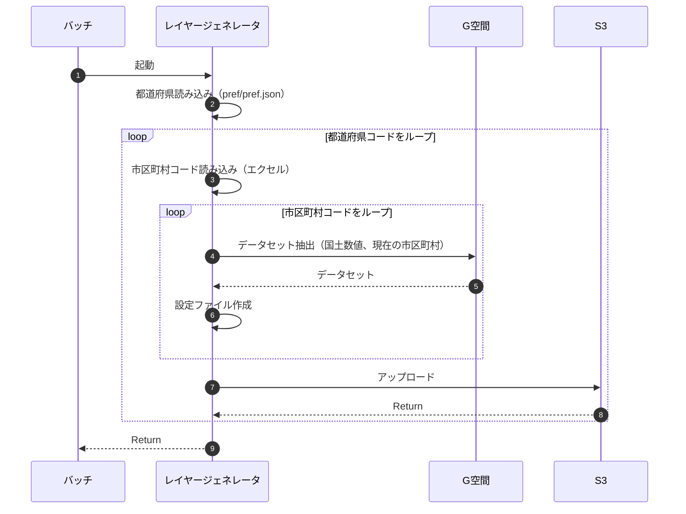
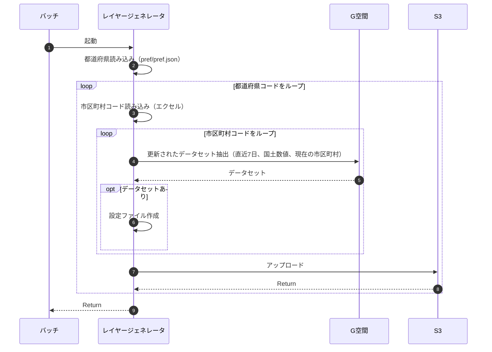

# Layer Generator

G空間情報センターへの負荷の観点から、全件取得ではなく、直近で修正されたデータセットを対象に設定ファイルを作成するように修正する。

### 現状の流れ（想像）

```mermaid
sequenceDiagram

autonumber
participant batch as バッチ
participant app as レイヤージェネレータ
participant gsic as G空間
participant S3

batch ->> app: 起動
app ->> app: 都道府県読み込み（pref/pref.json）
loop 都道府県コードをループ
	app ->> app: 市区町村コード読み込み（エクセル）
	loop 市区町村コードをループ
		app ->> gsic: データセット抽出（国土数値、現在の市区町村）
		gsic -->> app: データセット
		app ->> app: 設定ファイル作成
	end
	app ->> S3: アップロード
	S3 -->> app: Return
end
app -->> batch: Return
```

### 直近7日の更新分

```mermaid
sequenceDiagram

autonumber
participant batch as バッチ
participant app as レイヤージェネレータ
participant gsic as G空間
participant S3

batch ->> app: 起動
app ->> app: 都道府県読み込み（pref/pref.json）
loop 都道府県コードをループ
	app ->> app: 市区町村コード読み込み（エクセル）
	loop 市区町村コードをループ
		app ->> gsic: 更新されたデータセット抽出（直近7日、国土数値、現在の市区町村）
		gsic -->> app: データセット
		opt データセットあり
			app ->> app: 設定ファイル作成
		end
	end
	app ->> S3: アップロード
	S3 -->> app: Return
end
app -->> batch: Return
```