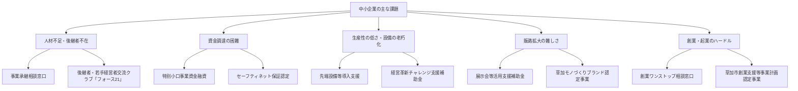

# Private

## ズボン

[2021/09川治温泉](Private/2021%2009%E5%B7%9D%E6%B2%BB%E6%B8%A9%E6%B3%89%20d175237edd1f41978c0b392ac155c1ec.md)

[自己紹介](Private/%E8%87%AA%E5%B7%B1%E7%B4%B9%E4%BB%8B%202c3610574a374f1b98dae96dee083582.md)

[マイナ](Private/%E3%83%9E%E3%82%A4%E3%83%8A%20f2d93d220e34480fbb2fc2425765b560.md)

[レシピブックマーク](Private/%E3%83%AC%E3%82%B7%E3%83%94%E3%83%96%E3%83%83%E3%82%AF%E3%83%9E%E3%83%BC%E3%82%AF%201b1205ca4089804c976ad1a8c11d2738.md)

[移住関連](Private/%E7%A7%BB%E4%BD%8F%E9%96%A2%E9%80%A3%2022f205ca40898061836ffb3e4856924d.md)

[北赤田購入＆リフォーム](Private/%E5%8C%97%E8%B5%A4%E7%94%B0%E8%B3%BC%E5%85%A5%EF%BC%86%E3%83%AA%E3%83%95%E3%82%A9%E3%83%BC%E3%83%A0%20293205ca408980cc9bb0df75d905d9be.md)