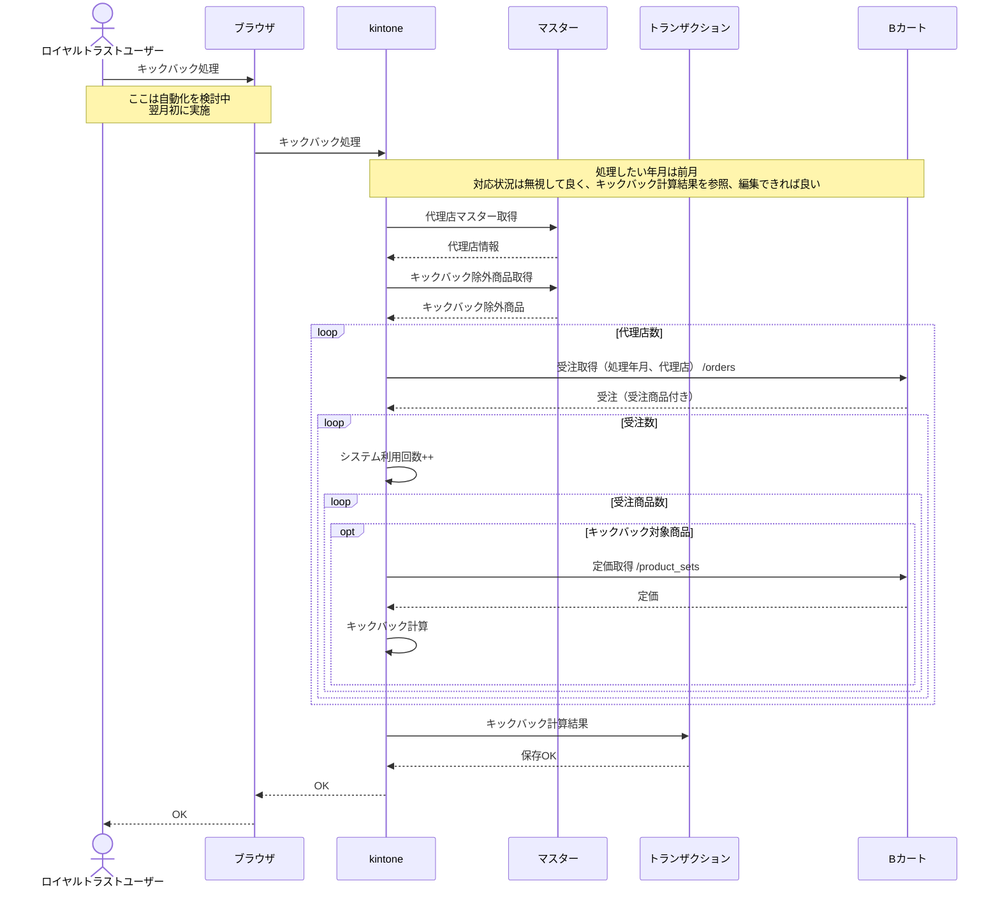

# キックバック仕様作成

Date Created: April 1, 2025 3:41 PM
Status: Done 🙌
組織: mqsol

## 確認事項

### 2025/04/07

- [x]  入力項目
- [x]  処理は、指定した年月の1日から末日まで
- [x]  注文の対応状況は、どのような値を持ってくれば良いか
    - [x]  CSV出力の条件を確認
    
    月初から月末まで
    
    状態は基本的には完了
    
    たまに「入金待ち」があるが、手で削除している
    
    取り込んだ情報を編集できるようにする
    
    取り込みは状態も行う
    
- [x]  キックバック計算方法
- [x]  キックバック対象外商品の見つけ方
    - [x]  JANコードか商品IDか？
        
        JANコード
        
        JANコードが入っていないものは、キックバック対象外
        
- [x]  受注商品ごとの小計は単価 x 数量？
- [x]  受注商品ごとの定価は必要か？
    
    必要
    
    定価は以下のいずれかの方法で取得
    
    - Bカートから取得
        - こっちが良いと考える
    - 以下の計算処理で算出
        - セット名＝店販用単品販売
            - 1 - 5個：定価の65%が単価
            - それ以上：定価の60%が単価
        - セット名＝業務用単品販売
            - 定価の65%
    
    キックバック計算は以下の２つ
    
    ２つの方法はマスターで設定できるようにする
    
    1. 受注商品ごと
        1. （サロンの単価 - 代理店の単価（定価 x 代理店の掛け率））x 数量
    2. サロン購入総額
        1. サロンの購入総額 x 代理店の掛け率

自社掛け売り

代理店がサロンに売掛で売っている

商品は、ロイヤルトラストからサロンに直行

請求は代理店がサロンに行う

ロイヤルトラストは、利益を抜いて代理店に請求している

この請求書を作成する（TODO）

代理店がサロンであることもある

現状はピュアラボーテのみ

ここは、最終的な精算書

## 画面項目

| 項目名 | タイプ | 備考 |
| --- | --- | --- |
| 処理年月 | カレンダー | 2025/03のように選択 |
| 実行 | ボタン | タップで処理を開始する |
|  |  |  |

## シーケンス



## 処理概要

### 代理店マスター取得

TODO kintoneの処理を確認

### キックバック除外商品取得

TODO kintoneの処理を確認

### 受注取得

GET orders

| パラメータ | 指定する値 | 形式 | 備考 |
| --- | --- | --- | --- |
|  | 代理店コード | 文字列 |  |
| ordered_at_min | 開始日時 | YYYY-MM-DD hh:mm:ss | 処理月の1日、0時0分0秒 |
| ordered_at_max | 終了日時 | YYYY-MM-DD hh:mm:ss | 処理月の月末日、23時59分59秒 |
| complete | 1 | 0 or 1 | 1指定することで、受注商品を取得 |

### キックバック対象商品の判定

受注商品のJANコードが以下のいずれかの場合、キックバック対象外と判定する。

- 空文字、もしくは未設定
- キックバック除外商品のJANコードと一致

### 定価取得

GET product_sets

| パラメータ | 指定する値 | 形式 | 備考 |
| --- | --- | --- | --- |
| id | 受注明細のproduct_set_id | 整数 |  |

### キックバック金額計算

以下の計算を行う。

小数点は切り捨てとする。

（サロンの単価 - （定価 x 代理店の掛け率））x 数量

| 項目名 | 取得元 | 備考 |
| --- | --- | --- |
| サロンの単価 | 受注商品のunit_price |  |
| 定価 | 定価のunit_price |  |
| 代理店の掛け率 | 代理店マスターの掛け率 |  |
| 数量 | 受注商品の受注数 |  |

### キックバック精算

| 列 | 取得元 | 対象項目 | 備考 |
| --- | --- | --- | --- |
| 代理店掛率 | 代理店マスター |  | 受注のcustom_parent_idが代理店マスターの代理店コードと一致 |
| 親代理店ID | 受注 | custom_parent_id |  |
| 受注日時 | 受注 | ordered_at |  |
| 決済方法 | 受注 | payment |  |
| 会社名 | 受注 | customer_comp_name |  |
| 商品名 | 受注商品 | product_name |  |
| セット名 | 受注商品 | set_name |  |
| 受注数 | 受注商品 | order_pro_count |  |
| 単価 | 受注商品 | unit_price | ボリュームディスカウント済み |
| 小計 |  |  | order_pro_count x unit_price |
| キックバック金額 |  |  | [キックバック金額計算](%E3%82%AD%E3%83%83%E3%82%AF%E3%83%90%E3%83%83%E3%82%AF%E4%BB%95%E6%A7%98%E4%BD%9C%E6%88%90%201c8205ca4089801cb822d8537b17f8aa.md)参照 |
| 代理店名 | 代理店マスター |  | 受注のcustom_parent_idが代理店マスターの代理店コードと一致 |
| 決済手数料 | 代理店マスター |  | 受注のcustom_parent_idが代理店マスターの代理店コードと一致 |
| システム手数料 | 代理店マスター |  | 受注のcustom_parent_idが代理店マスターの代理店コードと一致 |
| 定価 | 定価 | unit_price |  |
| 状態 | 受注 | status |  |

## マスター

### 代理店マスター

| 代理店コード | 代理店名 | 決済手数料(%) | システム利用料 | 代理店掛率 |
| --- | --- | --- | --- | --- |
| J0002 | 株式会社ピュアラボーテ | 3 | 300 | 40 |
| J0003 | 4e株式会社 | 3 | 300 | 40 |
| J0004 | 代理店J0004 | 3 | 300 | 40 |
| J0005 | 代理店J0005 | 3 | 300 | 40 |
| J0006 | 代理店J0006 | 3 | 300 | 40 |
| J0007 | 代理店J0007 | 3 | 300 | 40 |
| J0008 | 代理店J0008 | 3 | 300 | 40 |
| J0009 | 代理店J0009 | 3 | 300 | 40 |
| J0010 | 代理店J0010 | 3 | 300 | 40 |
| J0011 | 代理店J0011 | 3 | 300 | 40 |
| J0012 | 代理店J0012 | 3 | 300 | 40 |
| J0013 | 代理店J0013 | 3 | 300 | 40 |
| J0014 | 代理店J0014 | 3 | 300 | 40 |
| J0015 | featuring one | 3 | 300 | 45 |
| J0016 | 代理店J0016 | 3 | 300 | 40 |
| J0017 | 代理店J0017 | 3 | 300 | 40 |
| J0018 | 代理店J0018 | 3 | 300 | 40 |
| J0019 | 代理店J0019 | 3 | 300 | 40 |
| J0020 | 代理店J0020 | 3 | 300 | 40 |
| J0021 | 代理店J0021 | 3 | 300 | 40 |

### キックバック除外商品

| 商品ID | JANコード | 品番 |
| --- | --- | --- |
|  |  |  |
|  |  |  |

## トランザクション

### キックバック精算

| 代理店掛率 | 親代理店ID | 受注日時 | 決済方法 | 会社名 | 商品名 | セット名 | 受注数 | 単価 | 小計 | キックバック金額 | 代理店名 | 決済手数料 | システム手数料 | 定価 | 状態 |
| --- | --- | --- | --- | --- | --- | --- | --- | --- | --- | --- | --- | --- | --- | --- | --- |
| 代理店マスター | 受注 | 受注 | 受注 | 受注 | 受注商品 | 受注商品 | 受注商品 | 受注商品 |  |  | 代理店マスター | 代理店マスター | 代理店マスター | 商品セット | 受注 |
|  | custom_parent_id | ordered_at | payment | customer_comp_name | product_name | set_name | order_pro_count | unit_price |  |  |  |  |  | unit_price | status |
| custom_parent_idが代理店コードと一致 |  |  |  |  |  |  |  | ボリュームディスカウント済み | order_pro_count x unit_price | 計算？ | custom_parent_idが代理店コードと一致 | custom_parent_idが代理店コードと一致 | custom_parent_idが代理店コードと一致 |  |  |
| 40 | J0002 | 2022/2/1 6:33 | 自社掛払い | SEASON  AROMA LABO | 6+1クレンジングミルクキャンペーン | ミカエル | 1 | 24480 | 24480 | 8160 | 株式会社ピュアラボーテ | 3 | 300 | 16320 |  |
| 40 | J0002 | 2022/2/1 6:33 | 自社掛払い | SEASON  AROMA LABO | VAVITTE（ヴァヴィッテ）スムーティングクールパック【業務用】（25ｇ×5） | 業務用単品販売 | 3 | 5200 | 15600 | 6000 | 株式会社ピュアラボーテ | 3 | 300 | 3200 |  |
| 40 | J0002 | 2022/2/1 6:33 | 自社掛払い | SEASON  AROMA LABO | VAVITTE（ヴァヴィッテ）ハーブビタミンクリーム【業務用】200g | 業務用単品販売 | 1 | 14950 | 14950 | 5750 | 株式会社ピュアラボーテ | 3 | 300 | 9200 |  |
| 40 | J0002 | 2022/2/1 6:33 | 自社掛払い | SEASON  AROMA LABO | VAVITTE（ヴァヴィッテ）ハーブローション【業務用】500ml | 業務用単品販売 | 1 | 9750 | 9750 | 3750 | 株式会社ピュアラボーテ | 3 | 300 | 6000 |  |
| 40 | J0002 | 2022/2/1 6:33 | 自社掛払い | SEASON  AROMA LABO | VAVITTE（ヴァヴィッテ）ハーブディープジェル【業務用】100ml | 業務用単品販売 | 1 | 7800 | 7800 | 3000 | 株式会社ピュアラボーテ | 3 | 300 | 4800 |  |
| 40 | J0002 | 2022/2/1 11:40 | 代金引換 | Lani Blue | VAVITTE（ヴァヴィッテ）核酸セルボンバークリーム 【店】30g | 店販用単品販売 | 2 | 16250 | 32500 | 12500 | 株式会社ピュアラボーテ | 3 | 300 | 10000 |  |
| 40 | J0002 | 2022/2/1 12:22 | クレジット | エステティックサロンamii | 6+1クレンジングミルクキャンペーン | ミカエル | 2 | 24480 | 48960 | 16320 | 株式会社ピュアラボーテ | 3 | 300 | 16320 |  |
| 40 | J0002 | 2022/2/1 19:57 | クレジット | ReAmo | 6+1クレンジングミルクキャンペーン | ミカエル | 1 | 24480 | 24480 | 8160 | 株式会社ピュアラボーテ | 3 | 300 | 16320 |  |
| 40 | J0002 | 2022/2/1 19:57 | クレジット | ReAmo | VAVITTE（ヴァヴィッテ）プニッカオイル 【店】200ml | 店販用単品販売 | 1 | 11700 | 11700 | 4500 | 株式会社ピュアラボーテ | 3 | 300 | 7200 |  |
| 40 | J0002 | 2022/2/1 23:47 | クレジット | Roche hair design | 6+1クレンジングミルクキャンペーン | ミカエル | 1 | 24480 | 24480 | 8160 | 株式会社ピュアラボーテ | 3 | 300 | 16320 |  |
| 40 | J0002 | 2022/2/1 23:47 | クレジット | Roche hair design | VAVITTE（ヴァヴィッテ）ハーブディープジェル【店】50ml | 店販用単品販売 | 2 | 5200 | 10400 | 4000 | 株式会社ピュアラボーテ | 3 | 300 | 3200 |  |
| 40 | J0002 | 2022/2/2 10:09 | 自社掛払い | エステサロンMaCo | 6+1クレンジングミルクキャンペーン | ミカエル | 1 | 24480 | 24480 | 8160 | 株式会社ピュアラボーテ | 3 | 300 | 16320 |  |
| 40 | J0002 | 2022/2/2 10:09 | 自社掛払い | エステサロンMaCo | VAVITTE（ヴァヴィッテ）核酸セルボンバークリーム 【店】30g | 店販用単品販売 | 2 | 16250 | 32500 | 12500 | 株式会社ピュアラボーテ | 3 | 300 | 10000 |  |
| 40 | J0002 | 2022/2/2 10:09 | 自社掛払い | エステサロンMaCo | VAVITTE（ヴァヴィッテ）核酸セルボンバークリーム 【店】5g | 店販用単品販売 | 2 | 2925 | 5850 | 2250 | 株式会社ピュアラボーテ | 3 | 300 | 1800 |  |
| 40 | J0002 | 2022/2/2 10:09 | 自社掛払い | エステサロンMaCo | VAVITTE（ヴァヴィッテ）ハーブローション【店】150ml | 店販用単品販売 | 6 | 4080 | 24480 | 8160 | 株式会社ピュアラボーテ | 3 | 300 | 2720 |  |
| 40 | J0002 | 2022/2/2 10:09 | 自社掛払い | エステサロンMaCo | VAVITTE（ヴァヴィッテ）マルティナ美容液ファンデーション（ピュアナチュラル）【店】30g | 店販用単品販売 | 1 | 5200 | 5200 | 2000 | 株式会社ピュアラボーテ | 3 | 300 | 3200 |  |
| 40 | J0002 | 2022/2/2 10:09 | 自社掛払い | エステサロンMaCo | VAVITTE（ヴァヴィッテ）スムーティングクールパック【業務用】（25ｇ×5） | 業務用単品販売 | 1 | 5200 | 5200 | 2000 | 株式会社ピュアラボーテ | 3 | 300 | 3200 |  |

## データ取得

### 受注

2022/2/1 - 2022/2/28の受注で、受注商品もつける

```
https://api.bcart.jp/api/v1/orders?limit=100&ordered_at_min=2022-02-01+00%3A00%3A00&ordered_at_max=2022-02-28+23%3A59%3A59&complete=1
```

### 受注商品

JANコードが4589841830015の商品で、受注数が6個以上、受注IDが6000以上

```
https://api.bcart.jp/api/v1/order_products?jan_code=4589841830015&order_pro_count__gte=6&order_id__gte=6000
```