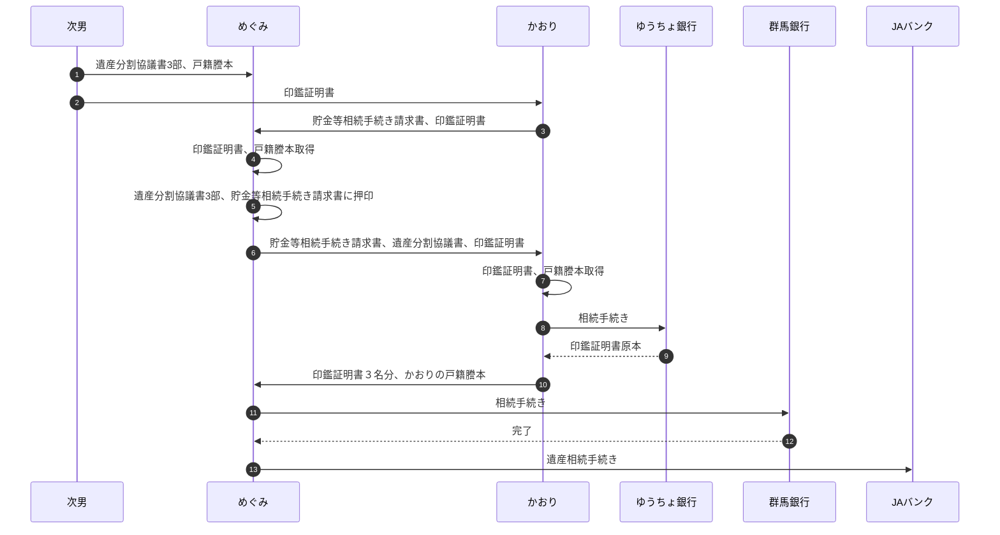

# 預金の遺産相続手続き

Date Created: March 8, 2025 11:21 AM
Status: Done 🙌
組織: 家族

各銀行の手続きに、印鑑証明書や戸籍謄本が必要なため、順次手続きをして、最低限の原本保持としたい。

## 手続きの流れ

1. 遺産分割協議書3部、戸籍謄本をめぐみに渡す
2. 次男の印鑑証明書をかおりに渡す
3. ゆうちょ銀行の手続き書類一式（貯金等相続手続き請求書含む）と次男の印鑑証明書をめぐみに渡す
4. めぐみが印鑑証明書、戸籍謄本を取る
5. めぐみが実印を確認して、遺産分割協議書3部と貯金等相続手続き請求書に押印する
6. めぐみの印鑑証明書と押印した遺産分割協議書1部、ゆうちょ銀行の手続き書類一式（押印した貯金等相続手続き請求書、次男の印鑑証明書含む）をかおりに渡す
7. かおりが印鑑証明書、戸籍謄本を取る
8. かおりがゆうちょ銀行の手続きを行う
9. 印鑑証明書（３名分）と、かおりの戸籍謄本をめぐみに渡す
10. めぐみが群馬銀行の手続きを行う
11. めぐみがJAバンクの手続きを行う

### 流れ

## 必要書類

### ゆうちょ銀行

- [x]  相続人全員の印鑑証明書（発行から6か月以内）
    - [x]  次男
    - [x]  かおり
    - [x]  めぐみ
- [x]  貯金等相続手続き請求書
- [x]  請求人(かおり)の本人確認書類
- [x]  被相続人(カツ子)の通帳

### 群馬銀行

- [x]  被相続人(カツ子)の出生から死亡までの戸籍謄本
- [x]  相続人全員の印鑑証明書（発行から3～6か月以内）
    - [x]  次男
    - [x]  かおり
    - [x]  めぐみ
- [x]  遺産分割協議書
- [ ]  (カツ子)通帳
- [ ]  (カツ子)キャッシュカード
- [ ]  相続手続依頼書（相続人全員の署名・実印の押印が必要）

### JAバンク

- [ ]  被相続人(カツ子)の出生から死亡までの戸籍謄本
- [ ]  相続人全員の戸籍謄本
    - [ ]  次男
    - [ ]  かおり
    - [ ]  めぐみ
- [ ]  相続人全員の印鑑証明書（発行から3～6か月以内）
    - [ ]  次男
    - [ ]  かおり
    - [ ]  めぐみ
- [ ]  遺産分割協議書
- [ ]  被相続人(カツ子)の通帳やキャッシュカード
- [ ]  相続に関する手続依頼書