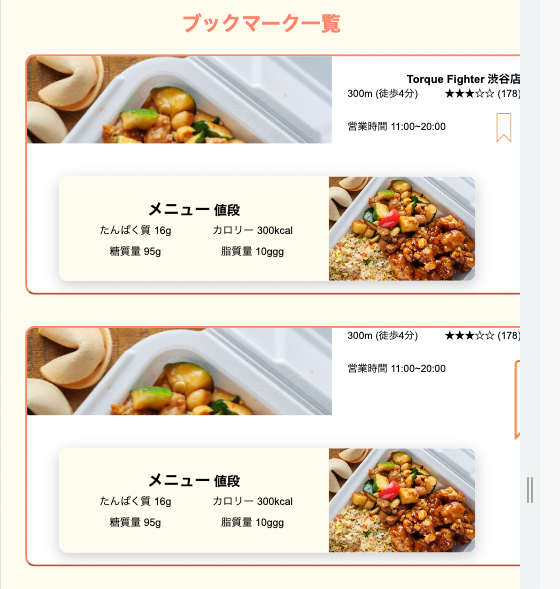

# BC23

# 日報

### 5/16

テクサポで行うことの相談

活動方針の決定

### 5/18

??

総合演習レビュー

### 5/22

テクサポのフロー決定

テクサポ依頼のテンプレート作成

AWSアクセス確認

### 5/23

AWSアクセス確認

サーバ動作確認

5/25

サーバチェックプログラムの追加仕様確認

サーバチェックプログラム動作確認

サーバチェックプログラムリーディング

### 5/31

サーバチェックプログラム動作確認

サーバチェックプログラムリーディング

1G

WBS、機能一覧、サイトマップレビュー

WBSの実装箇所を機能一覧、サイトマップに合わせて書き直したサンプルを提供

### 6/1

サーバチェックプログラム動作確認

サーバチェックプログラムリーディング

8G 安岡さん、星川さん

ボタンが真ん中にこない、ボタンアクティブの時色が変わらない相談

CSSをFigmaから出力したので、absoluteで構成されていて、スマホで表示したらおかしい

作り直しを提案、サンプル送付

2G ?

縦に真ん中に項目を並べたい

CSS資料のgridを参考にするアドバイス

背景色を全面的に変えたい

bodyのbackground-color

9G 森田さん

サンプルデータにCM_STORE_Aがない

CM_STOREと同じ

サンプルは壊れてそうなので、インポート手順に則ってインポート

### 6/6

11G 林さん 

セキュアWeb演習レビュー 1 - 3

1G 廣瀬さん

データベース構造の相談

位置情報での抽出方法相談

geometry型の使い方、説明まとめ

? ?

ボタンを画面中央に寄せたいCSS相談

元のCSSはFigmaの出力

? ?

地図のピンタップ時に開いた子画面に背景画像を表示したい

子画面の背景にアスペクト比を保って写真を表示する

??

### 6/7

11G 林さん セキュアWeb演習レビュー 4 - 7

1G 廣瀬さん

geometry型の使い方説明

geometry型を使わないSQLの説明

? ?

データベース説明（データベースとは、テーブルとは）

データベース作成のSQL説明

テーブル作成のSQL説明

? ?

誤ってmasterにマージした最後のMRを取り消したい

取り消したい最後のMRを選択して、OverviewのところでRevertを選択

MRが新たに作られるので、マージする

1G 竹澤

ddl.shが動かない

chmod u+xで実行権限をつける

権限の説明

2G 谷川

ドキュメントIDは番号じゃなくても良いか

チームで共有できれば問題ない

シーケンスはどこまで書くか

最後ログイン状態でホームに行くのであれば、どこで認証するかを記載する必要あり

シーケンスはホームに行くまで書いた方が良い

11G 高山

htmlとcssをプロジェクトフォルダにコピーしたらcssが外れた

読み込むcssファイル名が違った

同じようなスタイルを別名で作っているのが気がかり（感想）

8G 石川

カードの配置をデザイン通りにしたい

flexを使っているが、topが上に行き過ぎている

ファイルをもらった

画像がサイズ調整されないことが問題だった

zip内にnew.cssとして追加



[ブックマーク一覧画面.zip](BC23/%25E3%2583%2595%25E3%2582%2599%25E3%2583%2583%25E3%2582%25AF%25E3%2583%259E%25E3%2583%25BC%25E3%2582%25AF%25E4%25B8%2580%25E8%25A6%25A7%25E7%2594%25BB%25E9%259D%25A2.zip)

### 6/8

? ? 

ボタンを押したら出てくる画面を、完了ボタンや戻るボタンで戻したい

出てきた画面のどこを押しても戻ってしまう

出すためのボタンと戻すボタンが同じdivでくくられていて、toggle(’active’)が常に動いていた

出すためのボタンをIDにして、ボタンを押したときだけ、addClass(’active’)、完了ボタンや戻るボタンに別クラスをつけて、押されたときremoveClass(’active’)をするようにした

1G 桂樹先生

ERD、テーブル定義、必要データ一覧のレビュー

フィードバック

?G 足立先生

gitでセルフコンフリクトを起こして、そのままmainにマージできたけど、なんで？

コンフリクト状態のファイルのまま、解決したからかも（確証はない）

ツール間による現象かも（確証はない）

8G 鹿島先生

Aチームのシーケンス図レビュー

フィードバック

1G 竹澤

SQLでホットペッパーの予算（文字列）のMAXを数値として格納したい

格納文字列：1000円〜2000円」から、2000を抽出してintで格納

1000円〜」のような文字列があるのでうまくいかない

case文を使うよう指示

### 6/13

8G 星川

Google Mapのマーカーを選択したら、下のカードを動かしたい

addListenerでイベント追加したが、最後に追加したものになってしまう

順番はaddListener時点で渡しておく

12G 佐伯

VOにある

6G Cheng 

DAOでArrayListで返す時と、返さないときとの違いは何か

NULLとは何か

SQL中の?は何か

ShopServletで何すれば良いかわからない

パラメータを受け取って

ロジックを通してデータを受け取り

JSPに渡す

16 G

JSPのエラーになる

c:chooseとc:whenの間に、divやコメントがあったため

ログアウトできない

リダイレクト先のサーブレットで指定したJSPがおかしかった

10G 河野

JSで呼び出したServletが動かない

DAO内にループで更新している処理があったが、forのカウンターをインクリメントしてなかった

16G 安武

### 6/14

16G 安武

MRでマージできなかった

2日間マージしてないので、編集されたファイルが多数あった

developperブランチをマージしたら

? ?

Eclipseからサーバ実行できなくなった

.classpathにmodule trueの設定が入るようになった

削除したらできた

9G 西林

Buttonタグで囲ったら小さくなった

Buttonに当たっているスタイルの問題

モーダルを出したいなら、divにモーダルを出す属性を追加

クリックできることを示してあげても良い

スマホなので、やらなくても問題なし

8G 安岡

register.jspからサーブレットにくる方法がわからない

formのactionにURLを指定、methodを設計書に合わせる

今後何をしていくかわからない

シーケンスに合わせて実装する

ロジック

10G 小川泰正

Proxyを通さないと本番は動かない

Filterでセットする

WebSocketのURLもローカルと本番で異なる

Filterでセットする

環境変数を受け取ったりすると良いが、そこまではやらない

16G 長原

一人だけ「cannnot create poolableconnectionfactory」が出てログインできない

環境の問題？

先行して作成DBのパスワードが違ってた

### 6/15

4G 小野、田口（サポータ）

developでコミットした

ブランチを作って、developをリセット

```bash
git reset --soft HEAD^
```

1G 中野

ナビゲーションを外だししたら動かない

c:chooseのタグ構成内にコメントがあったので削除

whenの評価で、navName == “login” のダブルコーテーションをシングルコーテーションに変更

1G 吉田

モックhtmlの時は動いていたJavaScriptが動かない

元のファイル位置が違うので、JavaScriptファイルの位置を違えて読んでいた

1G 廣瀬

出発地、目的地の中点をAとし、Aから出発地、目的地の中点をB、Cとした時、出発地とA、AとB、Bと目的地をそれぞれ対角線とした四角内に存在するお店を抽出したいが、3つSQLを実行して一つにまとめ、重複を削除したい

UNION DISTINCTで3つのSQLを繋げる

9G 大河原

ログインのロジック作成してるが、ユーザ情報が取れない

context.xmlで指定したDBユーザに権限が与えられていない

context.xmlで指定した名称でJNDI指定していない

1G 岡本、辻中

AWSからログアウトする方法

exit

4G 園生

単純なHTMLをjspにしたプラポリが、全文表示しない（後半が途切れる）

Yasuiから持ってきて、不要なFooterをインポートしたため

2G 芳賀

JSからサーブレットを呼び出しているが、サーブレットにこない

キャッシュで、追記したサーブレットへのURLがロードされてなかった

バツボタンを押したら、homeに戻りたいが、真っ白になる

buttonタグのtypeを未指定だったので、submitされてた

history.back()の方が良いとのことで、その構文に変えた

### 6/19

1G 澤

清水講師

mysqlのインポートができない

/hoe/stdutyuser/sql

sqlが入ってる

/testdata

csv

狩野

リダイレクトができない

ApacheとTomcatの連携ができてない

書き方を伝えた

鈴木大智

CSSを取り込まないってどういうことをチェックすれば良い？

相手に取り込ませないのではなく、自サイトがよくわからないサイトのCSSを読み込んでないか確認すれば良い

2G 芳賀

プロフィールがおかしな改行をしている

プロフィール文の先頭におかしな開業とスペースが入っている

改行しなくてもよければ、white-space: pre-wrapを外す

1G 廣瀬

シーケンスの書き方

アクションによって分岐させて、分岐の結果、同じサーブレットにメッセージをくっている状態を表現してもらった

1G 竹澤

robots.txt

Google検索結果に出てこない方が良いページを指定する

そのようなものがなければ作成しない

8G 安岡

404.jspが出ない

web.xmlにエラーがあった

jspファイルの場所を間違えてた

16G 衣笠

サーバのJava17 -> 11にしたらサーバが動作しない

引き継いだ

確認したら、@webservletの値に同じもの「Mypage」が複数指定されていた

### 6/20

11B 狩野講師

本番でGoogle Maps APIが動かない

外部APIを使うので、プロキシの設定

```java
if (request.getRequestURL().indexOf("10.10.")!=-1) {
    System.setProperty("proxySet", "true");
    System.setProperty("proxyHost", "10.10.98.11");
    System.setProperty("proxyPort", "1080");
}
```

? 三浦講師

Exceptionのキャッチ後、エラーは出力するか

運用を考えたら、log4jでエラーは出した方が良い

また、ユーザが不安になるので500エラーよりはエラーメッセージの方が良いかも

? 小野

サーバが動かない

cloneし直し （編集済み）

? 芳賀

写真最大3枚登録したいが、1,2枚だとエラーになる

1枚の場合、ループ2回目のrequest.getParts()で取れる値のgetSubmittedFileNmae()がnullになっているので、null判定を入れる

また、写真が必須なのは最低1枚なので、カウンターが0の時にエラーとする

2G 谷口講師

actionの相対パスと、c:importのurlは何が違うか

actionはWebで公開したパス、c:importのurlは読み込むファイルの位置を取得するためのローカルパスとなる

12G 吉田

セキュリティチェックシートの確認

シェルを起動できる言語機能の利用を避ける。

exec()を使ってOSコマンドを投げるような実装をしていない

外部からのパラメータでウェブサーバ内のファイル名を直接指定する実装を避ける。

外部からのパラメータでディレクトリが含まれていない

13G 長原

サーバで動かない

SecureRandom.getInstanceStrong()は貧弱なサーバでは動かない

SecureRandom.getInstance("SHA1PRNG")を使う