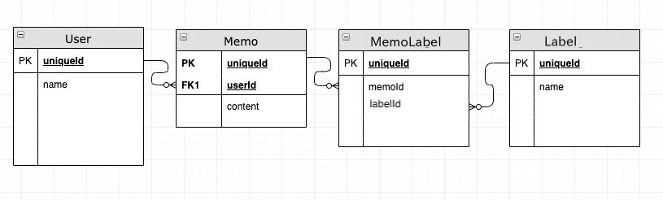

# slick

# Join

テーブルを結合する。

複数結合する場合は、２つずつの結合を繰り返すとわかりやすい。変数にセットしなくても上から評価されて、結果は同じ。

以下のテーブル構成でJoinしてデータを取得する方法は以下の通り。



```json
val labels = MemoLabel join Label on (_.labelId === _.uniqueId)
val labelsAndMemos = Memo joinLeft labels on (_.uniqueId === _._1.memoId)
val action = User joinLeft labelsAndMemos on (_.uniqueId === _._1.userId)
```

手順：

1. `MemoLabel`と `Label`を結合（ `MemoLabel.labelId`と `Label.uniqueId`で結合）、 `labels`に代入
2. `labels`にはタプルでテーブルの内容が入っているので、 `MemoLabel`にアクセスするには `_1`、Labelにアクセスするには `_2` を使用
3. 

[ScalaDB用ライブラリ、Slickを使い倒すハンズオン - Qiita](https://qiita.com/sonken625/items/bcfe5f78323a67205933)

# 複数のSQLをまとめて実行する方法

db.runで実行する単位がトランザクション単位になるので、複数のことをまとめたい場合は、ちょっとテクニカルになる。

[Slick3のSQLクエリを複数結合する | 50ぱーせんとおふ](http://mashi.exciton.jp/archives/189)